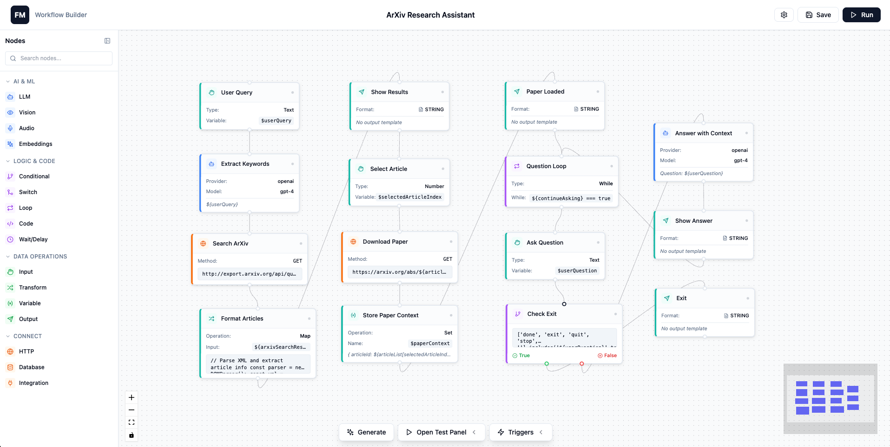

# FlowMaestro

> Enterprise-Grade LLM Agent Orchestration System - Build, Deploy, and Scale AI Workflows



FlowMaestro is a production-ready platform for orchestrating complex AI agent workflows through a visual canvas interface. It provides durable execution guarantees, real-time monitoring, and enterprise-scale deployment capabilities on AWS infrastructure.

## Table of Contents

- [Introduction](#introduction)
- [Key Features](#key-features)
- [System Architecture](#system-architecture)
- [Technology Stack](#technology-stack)
- [Getting Started](#getting-started)
- [AWS Deployment](#aws-deployment)
- [API Reference](#api-reference)
- [Database Schema](#database-schema)
- [Development Guide](#development-guide)
- [Contributing](#contributing)
- [Project Structure](#project-structure)
- [Documentation](#documentation)

---

## Introduction

FlowMaestro enables teams to build sophisticated AI workflows by visually connecting nodes representing different operations: LLM calls, conditional logic, data transformations, API integrations, and human-in-the-loop interactions. The platform guarantees workflow durability through Temporal, ensuring that long-running workflows survive system failures and can be paused, resumed, and retried with confidence.

### Use Cases

- **Multi-Agent AI Systems**: Orchestrate multiple AI agents with different specializations working together
- **Document Processing Pipelines**: Extract, transform, and analyze documents with AI-powered workflows
- **Customer Support Automation**: Build intelligent support bots with escalation paths to human agents
- **Data Enrichment**: Combine multiple data sources and AI models to enrich business data
- **Content Generation**: Create complex content generation pipelines with review and approval steps

---

## Key Features

### Core Capabilities

- **Visual Workflow Builder**: Drag-and-drop canvas powered by React Flow with 23+ pre-built node types
- **Durable Execution**: Temporal-based orchestration ensures workflows survive failures and restarts
- **Multi-LLM Support**: Integrated support for OpenAI, Anthropic Claude, Google Gemini, and Cohere
- **Real-time Monitoring**: WebSocket-based live updates for workflow execution progress
- **Human-in-the-Loop**: Pause workflows for human input, review, or approval
- **Variable System**: Reference outputs from any node using `${node_id.output}` syntax
- **Conditional Logic**: Dynamic routing with if/else conditionals and switch statements
- **Loops & Iteration**: Process arrays and collections with built-in loop constructs
- **Data Transformation**: JSONata and JMESPath support for complex data mapping
- **Code Execution**: Sandboxed JavaScript/Python execution for custom logic
- **Integration Ecosystem**: Pre-built connectors for Slack, Notion, Email, and custom webhooks
- **Retry & Error Handling**: Automatic retry with exponential backoff and error propagation
- **Version Control**: Track workflow versions and enable rollback
- **Testing Tools**: Test workflows with sample inputs before deployment

### Advanced Features

- **Streaming Support**: Real-time streaming of LLM responses during execution
- **Batch Processing**: Execute multiple workflow instances in parallel
- **Rate Limiting**: Built-in rate limiting for external API calls
- **Caching**: Redis-based caching for expensive operations
- **Audit Logging**: Comprehensive execution logs for compliance and debugging
- **Multi-tenancy**: User-based isolation with JWT authentication
- **File Operations**: Built-in support for PDF parsing, CSV processing, and file uploads
- **Vision & Audio**: Image analysis, generation, speech-to-text, and text-to-speech nodes
- **Embeddings**: Generate and query vector embeddings for semantic search

---

## System Architecture

FlowMaestro employs a distributed microservices architecture designed for scalability, resilience, and maintainability.

### High-Level Architecture

The system consists of five primary layers:

**Presentation Layer**
- React-based single-page application (SPA)
- React Flow canvas for visual workflow building
- Zustand for client-side state management
- WebSocket client for real-time updates
- Served via Vite development server (local) or CloudFront + S3 (production)

**API Gateway Layer**
- Fastify HTTP server handling REST API requests
- JWT-based authentication middleware
- Request validation using Zod schemas
- CORS configuration for cross-origin requests
- WebSocket server for bi-directional communication
- Horizontally scalable (stateless)

**Orchestration Layer**
- Temporal workflow engine for durable execution
- Custom orchestrator workflow implementing topological DAG execution
- Activity-based node executors (one per node type)
- Workflow task queue: `flowmaestro-orchestrator`
- Worker processes that poll for tasks and execute activities

**Data Layer**
- PostgreSQL 15 for persistent storage (workflows, executions, users, integrations)
- Redis 7 for caching, session management, and real-time event distribution
- Temporal's internal PostgreSQL database for workflow state
- S3 for file storage (optional, for production deployments)

**Integration Layer**
- External LLM APIs (OpenAI, Anthropic, Google, Cohere)
- Third-party service integrations (Slack, Notion, Email via SES)
- Custom webhook support for arbitrary HTTP endpoints
- Database connectors for SQL and NoSQL databases

### Component Interaction Flow

**Workflow Creation Flow**:
1. User designs workflow in React Flow canvas
2. Frontend validates graph structure (no cycles, connected nodes)
3. POST request to `/api/workflows` with workflow definition (nodes + edges)
4. Backend validates definition and stores in PostgreSQL
5. Returns workflow ID to frontend

**Workflow Execution Flow**:
1. User triggers execution via `/api/workflows/execute` with input parameters
2. API validates inputs and creates execution record in PostgreSQL
3. API calls Temporal client to start `orchestratorWorkflow`
4. Temporal queues workflow on `flowmaestro-orchestrator` task queue
5. Worker picks up workflow and begins execution
6. Orchestrator builds execution graph from nodes and edges
7. Identifies start nodes (input types or nodes with no dependencies)
8. Executes nodes in topological order, respecting dependencies
9. Each node execution is an activity that calls specific node executor
10. Executors emit events via EventBridge to WebSocket connections
11. Frontend receives real-time updates and displays progress
12. On completion, workflow returns final outputs
13. Execution record updated with status and outputs

**Real-time Communication**:
- Frontend establishes WebSocket connection on `/ws` with JWT token
- Backend maintains connection map (user_id → WebSocket connections)
- Temporal activity executors emit events through EventBridge
- EventBridge routes events to appropriate WebSocket connections
- Events include: execution started/completed/failed, node progress, streaming data

### Temporal Workflow Architecture

**Workflows**:
- `orchestratorWorkflow`: Main workflow that executes the entire DAG
  - Builds node map and edge map for dependency tracking
  - Maintains execution context for variable resolution
  - Handles error propagation and skip logic
  - Supports parallel execution of independent nodes
- `userInputWorkflow`: Child workflow for human-in-the-loop interactions
- `longRunningTaskWorkflow`: For tasks exceeding activity timeout limits

**Activities**:
- `executeNode`: Routes to specific executor based on node type
- `executeNodeBatch`: Parallel execution of multiple independent nodes
- Each node type has dedicated executor in `/temporal/activities/node-executors/`

**Node Executors** (23+ types):
- **LLM Executor**: Calls OpenAI, Anthropic, Google, or Cohere APIs
- **Vision Executor**: Image analysis and generation (DALL-E, GPT-4 Vision)
- **Audio Executor**: Speech-to-text (Whisper) and text-to-speech
- **Embeddings Executor**: Generate vector embeddings for semantic search
- **Code Executor**: Sandboxed JavaScript/Python execution using VM2
- **HTTP Executor**: Make REST API calls with retry logic
- **Database Executor**: Execute SQL/NoSQL queries
- **Conditional Executor**: If/else branching logic
- **Switch Executor**: Multi-way branching
- **Loop Executor**: Iterate over arrays and collections
- **Transform Executor**: JSONata and JMESPath data transformation
- **Variable Executor**: Store and retrieve workflow variables
- **File Operations Executor**: Parse PDFs, CSVs, XML, JSON
- **Integration Executor**: Call external services (Slack, Notion, Email)
- **User Input Executor**: Pause for human interaction
- **Output Executor**: Define workflow outputs
- **Wait Executor**: Delay execution for specified duration
- **Echo Executor**: Pass-through for testing and debugging

**Workflow Durability**:
- All workflow state persisted to PostgreSQL by Temporal
- Workflows can be paused, resumed, cancelled at any time
- Activities automatically retried on transient failures (3 retries, exponential backoff)
- Workflow execution history provides full audit trail
- Workers can be restarted without losing in-flight workflows

### Database Design

**Core Tables**:

**users**
- Stores user accounts with email and hashed passwords
- Password hashing uses pgcrypto extension (bcrypt)
- Tracks last login timestamp
- Soft delete support

**workflows**
- Stores workflow definitions as JSONB (nodes + edges)
- Versioning support (incremental version numbers)
- Belongs to user (multi-tenancy)
- Soft delete with `deleted_at` timestamp
- GIN index on definition JSONB for fast querying

**executions**
- Records of workflow runs with status tracking
- Statuses: pending → running → completed/failed/cancelled
- Stores inputs, outputs, and current state as JSONB
- Foreign key to workflow and execution record
- Indexed on workflow_id, status, and created_at for efficient queries

**execution_logs**
- Detailed logs for each node execution
- Log levels: info, warn, error
- Metadata stored as JSONB (node outputs, error details, timing)
- High-volume table with efficient indexing

**integrations**
- External service configurations (API keys, OAuth tokens)
- Encrypted credentials stored in JSONB
- User-specific integration instances
- Enabled/disabled toggle for activation control

### WebSocket Event System

**Connection Management**:
- Clients connect via `/ws` with JWT token (query param or header)
- Server validates token and associates connection with user_id
- Multiple connections per user supported (multiple browser tabs)
- Heartbeat/ping-pong for connection health

**Event Types**:
- `connection:established`: Initial handshake confirmation
- `execution:started`: Workflow begins with execution_id
- `execution:progress`: Periodic progress updates (% complete, current nodes)
- `execution:completed`: Workflow finished successfully with outputs
- `execution:failed`: Workflow encountered error with error details
- `node:started`: Individual node begins execution
- `node:completed`: Node finishes with outputs
- `node:failed`: Node encounters error
- `node:retry`: Node is being retried after failure
- `node:stream`: Streaming data from LLM nodes (real-time tokens)
- `user:input:required`: Workflow paused, awaiting human input
- `user:input:response`: User provided input, execution resuming

**Event Payload Structure**:
```json
{
  "type": "node:completed",
  "timestamp": "2024-01-15T10:30:45.123Z",
  "execution_id": "uuid",
  "node_id": "node-123",
  "data": {
    "output": "result data",
    "duration_ms": 1234
  }
}
```

---

## Technology Stack

### Frontend Technologies

**Core Framework**
- **React 18.2.0**: Component-based UI framework
- **TypeScript 5.3.3**: Static typing for JavaScript
- **Vite 5.1.0**: Fast build tool with HMR (Hot Module Replacement)

**UI Libraries**
- **React Flow 11.10.4**: Visual workflow canvas with drag-and-drop
- **Radix UI**: Accessible component primitives (Dialog, Dropdown, Tooltip, etc.)
- **Tailwind CSS 3.4.1**: Utility-first CSS framework
- **Lucide React**: Icon library with consistent design

**State Management**
- **Zustand 4.5.0**: Lightweight state management
- **TanStack Query 5.18.0** (formerly React Query): Server state caching and synchronization
- **Immer**: Immutable state updates

**Real-time Communication**
- **Socket.IO Client 4.7.4**: WebSocket client for bi-directional communication

**Development Tools**
- **Vitest**: Unit testing framework
- **Playwright**: End-to-end testing
- **ESLint**: Code linting
- **Prettier**: Code formatting

### Backend Technologies

**Core Framework**
- **Node.js 20+**: JavaScript runtime
- **TypeScript 5.3.3**: Static typing
- **Fastify 4.26.0**: Fast web framework (3x faster than Express)

**Database & Caching**
- **PostgreSQL 15**: Primary relational database
- **pg 8.11.3**: PostgreSQL client for Node.js
- **Redis 7**: In-memory cache and pub/sub
- **BullMQ 5.3.0**: Redis-based job queue

**Workflow Orchestration**
- **Temporal 1.23.0**: Durable workflow engine
- **@temporalio/client**: Client SDK for starting workflows
- **@temporalio/worker**: Worker SDK for executing workflows/activities
- **@temporalio/workflow**: Workflow definition SDK
- **@temporalio/activity**: Activity implementation SDK

**AI/LLM Integration**
- **OpenAI SDK 6.7.0**: GPT-4, GPT-3.5, DALL-E, Whisper, Embeddings
- **Anthropic SDK 0.67.0**: Claude 3 (Opus, Sonnet, Haiku)
- **@google/generative-ai 0.24.1**: Gemini Pro, Gemini Vision
- **Cohere AI 7.19.0**: Cohere language models

**Data Processing**
- **JSONata 2.1.0**: JSON query and transformation language
- **JMESPath**: JSON query language
- **xml2js 0.6.2**: XML parser
- **pdf-parse 2.4.5**: PDF text extraction
- **csv-parse 5.5.3**: CSV parsing
- **VM2 3.10.0**: Sandboxed JavaScript execution

**Authentication & Security**
- **@fastify/jwt 8.0.0**: JWT token generation and validation
- **bcrypt**: Password hashing (via pgcrypto in PostgreSQL)

**HTTP & Networking**
- **Axios 1.12.2**: HTTP client for external API calls
- **@fastify/cors 9.0.1**: CORS middleware
- **@fastify/websocket 10.0.0**: WebSocket support
- **Nodemailer 7.0.10**: Email sending via SMTP/SES

**Validation & Schemas**
- **Zod 3.22.4**: TypeScript-first schema validation
- **Ajv 8.12.0**: JSON Schema validator

**Utilities**
- **uuid 9.0.1**: UUID generation
- **date-fns 3.2.0**: Date manipulation
- **lodash 4.17.21**: Utility functions

### Infrastructure & DevOps

**Containerization**
- **Docker 24+**: Container runtime
- **Docker Compose**: Multi-container orchestration (local development)

**Database**
- **PostgreSQL 15**: Official Docker image
- **pgcrypto**: PostgreSQL extension for password hashing
- **uuid-ossp**: UUID generation extension

**Caching**
- **Redis 7**: Official Alpine Docker image

**Workflow Engine**
- **Temporal Server 1.23.0**: Official Docker image with auto-setup
- **Temporal UI 2.22.3**: Web interface for monitoring workflows

**AWS Services** (Production)
- **ECS (Elastic Container Service)**: Container orchestration
- **Fargate**: Serverless container compute
- **RDS PostgreSQL**: Managed database service
- **ElastiCache Redis**: Managed Redis cluster
- **Application Load Balancer**: Traffic distribution and SSL termination
- **CloudFront**: CDN for frontend assets
- **S3**: Static asset storage and file uploads
- **SES (Simple Email Service)**: Transactional email
- **Secrets Manager**: Secure credential storage
- **CloudWatch**: Logging and monitoring
- **VPC**: Network isolation and security

**CI/CD**
- **GitHub Actions**: Automated build, test, and deployment
- **Docker Hub / ECR**: Container registry

**Monitoring & Logging**
- **CloudWatch Logs**: Centralized logging
- **CloudWatch Metrics**: Application metrics
- **Temporal UI**: Workflow execution monitoring

---

## Getting Started

### Prerequisites

Before you begin, ensure you have the following installed:

- **Node.js** >= 20.0.0 ([Download](https://nodejs.org/))
- **npm** >= 10.0.0 (comes with Node.js)
- **Docker Desktop** ([Download](https://www.docker.com/products/docker-desktop))
- **Docker Compose** (included with Docker Desktop)
- **Git** ([Download](https://git-scm.com/downloads))

**System Requirements**:
- 4GB+ available RAM (for Docker containers)
- 2GB+ disk space
- macOS, Linux, or Windows with WSL2

### Installation

#### 1. Clone the Repository

```bash
git clone https://github.com/yourusername/flowmaestro.git
cd flowmaestro
```

#### 2. Install Dependencies

```bash
npm install
```

This command installs dependencies for all workspaces (frontend, backend, shared) using npm workspaces.

#### 3. Configure Environment Variables

Create a `.env` file in the root directory:

```bash
cp .env.example .env
```

Edit `.env` with your configuration:

```env
# Database Configuration
POSTGRES_HOST=localhost
POSTGRES_PORT=5432
POSTGRES_DB=flowmaestro
POSTGRES_USER=flowmaestro
POSTGRES_PASSWORD=flowmaestro_dev_password

# Redis Configuration
REDIS_HOST=localhost
REDIS_PORT=6379

# Temporal Configuration
TEMPORAL_ADDRESS=localhost:7233

# Backend Configuration
BACKEND_PORT=3001
BACKEND_HOST=0.0.0.0
NODE_ENV=development
LOG_LEVEL=debug
JWT_SECRET=your-secret-key-change-in-production-to-random-string

# Frontend Configuration
VITE_API_URL=http://localhost:3001
VITE_WS_URL=ws://localhost:3001

# CORS Configuration
CORS_ORIGIN=http://localhost:3000,http://localhost:5173

# LLM Provider API Keys (Optional - for testing)
OPENAI_API_KEY=sk-your-openai-key
ANTHROPIC_API_KEY=sk-ant-your-anthropic-key
GOOGLE_AI_API_KEY=your-google-ai-key
COHERE_API_KEY=your-cohere-key

# Integration Credentials (Optional)
SLACK_CLIENT_ID=your-slack-client-id
SLACK_CLIENT_SECRET=your-slack-client-secret
NOTION_CLIENT_ID=your-notion-client-id
NOTION_CLIENT_SECRET=your-notion-client-secret

# Email Configuration (Optional)
SMTP_HOST=smtp.gmail.com
SMTP_PORT=587
SMTP_USER=your-email@gmail.com
SMTP_PASS=your-app-password
```

#### 4. Start Infrastructure Services

```bash
npm run docker:up
```

This starts the following services via Docker Compose:
- **PostgreSQL** on port 5432
- **Redis** on port 6379
- **Temporal Server** on port 7233
- **Temporal UI** on port 8088

Wait for all services to be healthy:

```bash
docker-compose ps
```

You should see all services in "Up" state with health checks passing.

#### 5. Start Development Services

```bash
npm run dev
```

This starts all services concurrently:
- **Frontend**: Vite dev server on http://localhost:3000
- **Backend**: API server on http://localhost:3001
- **Worker**: Temporal worker process

Alternatively, start services individually:

```bash
# Terminal 1: Backend API
npm run dev:backend

# Terminal 2: Frontend UI
npm run dev:frontend

# Terminal 3: Temporal Worker
npm run worker:orchestrator
```

#### 7. Access the Application

Open your browser and navigate to:

- **Frontend UI**: http://localhost:3000
- **Backend API**: http://localhost:3001 (health check: http://localhost:3001/health)
- **Temporal UI**: http://localhost:8088

**Default Login Credentials** (for testing):
- Email: `test@flowmaestro.dev`
- Password: `testpassword123`

### Quick Start Workflow

1. **Login**: Use default credentials or register a new account
2. **Create Workflow**: Click "New Workflow" in the workflow library
3. **Build Workflow**: Drag nodes from the palette onto the canvas
4. **Connect Nodes**: Draw edges between nodes to define execution order
5. **Configure Nodes**: Click nodes to configure their settings
6. **Test Workflow**: Click "Test" to execute with sample inputs
7. **Monitor Execution**: Watch real-time progress in the execution panel
8. **View Results**: Inspect node outputs and overall workflow results

---

## AWS Deployment

FlowMaestro is designed for production deployment on AWS infrastructure, leveraging managed services for scalability, reliability, and operational efficiency.

### AWS Architecture Overview

The production architecture uses the following AWS services:

**Compute**
- **ECS on Fargate**: Runs backend API containers and Temporal worker containers
- **Application Load Balancer (ALB)**: Distributes traffic across ECS tasks, handles SSL/TLS termination
- **Auto Scaling**: Automatically scales ECS tasks based on CPU/memory utilization

**Data Persistence**
- **RDS PostgreSQL**: Multi-AZ deployment for high availability
- **ElastiCache Redis**: Clustered Redis for caching and session management
- **S3**: Stores frontend static assets, user-uploaded files, and backups

**Content Delivery**
- **CloudFront**: CDN for frontend assets with global edge locations
- **S3**: Origin for static assets

**Networking**
- **VPC**: Isolated network with public and private subnets across multiple availability zones
- **Security Groups**: Firewall rules for service-to-service communication
- **NAT Gateway**: Outbound internet access for private subnet resources

**Security & Secrets**
- **Secrets Manager**: Stores database credentials, API keys, JWT secrets
- **IAM Roles**: Service-level permissions with principle of least privilege
- **Certificate Manager (ACM)**: SSL/TLS certificates for HTTPS

**Monitoring & Logging**
- **CloudWatch Logs**: Centralized application logs with log groups per service
- **CloudWatch Metrics**: Custom metrics for workflow executions, API latency, error rates
- **CloudWatch Alarms**: Automated alerting for critical issues
- **X-Ray**: Distributed tracing for request flows

### Infrastructure Components

#### Network Architecture

**VPC Configuration**:
- CIDR Block: `10.0.0.0/16`
- Public Subnets: `10.0.1.0/24`, `10.0.2.0/24` (for ALB)
- Private Subnets: `10.0.10.0/24`, `10.0.11.0/24` (for ECS tasks, RDS, ElastiCache)
- NAT Gateway in each public subnet for high availability

**Security Groups**:
- ALB Security Group: Allows inbound 80/443 from internet, outbound to ECS tasks
- ECS Security Group: Allows inbound 3001 from ALB, outbound to RDS/Redis/Internet
- RDS Security Group: Allows inbound 5432 from ECS security group
- Redis Security Group: Allows inbound 6379 from ECS security group

#### ECS Configuration

**Cluster**: `flowmaestro-production`

**Services**:

**Backend API Service**:
- Task Definition: `flowmaestro-backend`
- Container: Node.js backend image from ECR
- Desired Count: 2 (minimum for high availability)
- Auto Scaling: Scale between 2-10 tasks based on CPU (target: 70%)
- Health Check: GET `/health` endpoint
- Environment Variables: Loaded from Secrets Manager
- Resource Allocation:
  - CPU: 512 (0.5 vCPU)
  - Memory: 1024 MB (1 GB)
- Networking: Private subnets, registered with ALB target group

**Temporal Worker Service**:
- Task Definition: `flowmaestro-worker`
- Container: Node.js worker image from ECR
- Desired Count: 2 (minimum for redundancy)
- Auto Scaling: Scale between 2-5 tasks based on Temporal task queue length (custom metric)
- Health Check: Process-level health check
- Environment Variables: Loaded from Secrets Manager
- Resource Allocation:
  - CPU: 1024 (1 vCPU)
  - Memory: 2048 MB (2 GB)
- Networking: Private subnets

#### RDS PostgreSQL Configuration

**Instance**:
- Engine: PostgreSQL 15
- Instance Class: `db.t3.medium` (2 vCPU, 4 GB RAM) for production
- Multi-AZ: Enabled for automatic failover
- Storage: 100 GB GP3 with auto-scaling up to 500 GB
- Backup Retention: 7 days
- Automated Backups: Daily at 03:00 UTC
- Security: Encryption at rest with KMS, encryption in transit with SSL

**Databases**:
- `flowmaestro` - Application database
- `temporal` - Temporal workflow state

**Parameter Group**: Custom parameter group with optimized settings:
- `max_connections`: 200
- `shared_buffers`: 1GB
- `effective_cache_size`: 3GB
- `work_mem`: 10MB

#### ElastiCache Redis Configuration

**Cluster Mode**: Enabled for horizontal scaling
- Node Type: `cache.t3.medium` (2 vCPU, 3.09 GB RAM)
- Number of Shards: 2
- Replicas per Shard: 1 (for high availability)
- Engine: Redis 7.0
- Encryption: At rest and in transit
- Automatic Failover: Enabled

#### Application Load Balancer

**Configuration**:
- Scheme: Internet-facing
- Subnets: Public subnets in multiple AZs
- Security Group: Allows 80/443 from internet

**Listeners**:
- HTTP (80): Redirects to HTTPS (443)
- HTTPS (443): Routes to backend target group, terminates SSL

**Target Group**:
- Protocol: HTTP
- Port: 3001
- Health Check: GET `/health` every 30s
- Healthy Threshold: 2 consecutive successes
- Unhealthy Threshold: 3 consecutive failures

#### CloudFront Distribution

**Configuration**:
- Origin: S3 bucket with frontend static assets
- Origin Access Identity: CloudFront-only access to S3
- Cache Behavior:
  - Default: Cache all static assets (JS, CSS, images)
  - `/api/*`: No caching, forward to ALB origin
- SSL Certificate: ACM certificate for custom domain
- HTTP Version: HTTP/2 enabled
- Compression: Enabled for text-based content

#### S3 Buckets

**Frontend Assets Bucket**: `flowmaestro-frontend-{env}`
- Purpose: Stores built React application (HTML, JS, CSS)
- Versioning: Enabled
- Public Access: Blocked (CloudFront OAI only)
- Lifecycle: Delete old versions after 90 days

**User Files Bucket**: `flowmaestro-files-{env}`
- Purpose: Stores user-uploaded files (PDFs, CSVs, etc.)
- Versioning: Enabled
- Encryption: SSE-S3
- Lifecycle: Move to Glacier after 180 days

### Deployment Process

#### Infrastructure Provisioning

**Option 1: Terraform** (Recommended)

Create infrastructure using Terraform:

```bash
cd infrastructure/terraform

# Initialize Terraform
terraform init

# Review planned changes
terraform plan -var-file=production.tfvars

# Apply infrastructure
terraform apply -var-file=production.tfvars
```

**Option 2: AWS CDK**

Deploy infrastructure using CDK:

```bash
cd infrastructure/cdk

# Install dependencies
npm install

# Bootstrap CDK (first time only)
cdk bootstrap

# Deploy stacks
cdk deploy FlowMaestroStack --require-approval never
```

#### Application Deployment

**CI/CD Pipeline** (GitHub Actions):

The deployment pipeline is triggered on push to `main` branch:

1. **Build Stage**:
   - Checkout code
   - Run tests (unit, integration)
   - Build frontend (Vite)
   - Build backend (TypeScript compilation)
   - Build Docker images for backend and worker

2. **Push Stage**:
   - Tag images with commit SHA and `latest`
   - Push images to ECR

3. **Deploy Stage**:
   - Update ECS task definitions with new image tags
   - Deploy frontend assets to S3
   - Invalidate CloudFront cache
   - Update ECS services (rolling deployment)
   - Wait for health checks to pass

**Manual Deployment**:

Deploy frontend:
```bash
cd frontend
npm run build
aws s3 sync dist/ s3://flowmaestro-frontend-production
aws cloudfront create-invalidation --distribution-id XXXX --paths "/*"
```

Deploy backend:
```bash
cd backend
docker build -t flowmaestro-backend:latest .
docker tag flowmaestro-backend:latest 123456789.dkr.ecr.us-east-1.amazonaws.com/flowmaestro-backend:latest
docker push 123456789.dkr.ecr.us-east-1.amazonaws.com/flowmaestro-backend:latest

aws ecs update-service --cluster flowmaestro-production --service backend --force-new-deployment
```

Deploy worker:
```bash
cd backend
docker build -f Dockerfile.worker -t flowmaestro-worker:latest .
docker tag flowmaestro-worker:latest 123456789.dkr.ecr.us-east-1.amazonaws.com/flowmaestro-worker:latest
docker push 123456789.dkr.ecr.us-east-1.amazonaws.com/flowmaestro-worker:latest

aws ecs update-service --cluster flowmaestro-production --service worker --force-new-deployment
```

#### Database Migrations

Run migrations against RDS:

```bash
# Set environment variables
export POSTGRES_HOST=flowmaestro-db.xxxxx.us-east-1.rds.amazonaws.com
export POSTGRES_PORT=5432
export POSTGRES_DB=flowmaestro
export POSTGRES_USER=flowmaestro
export POSTGRES_PASSWORD=$(aws secretsmanager get-secret-value --secret-id flowmaestro/db/password --query SecretString --output text)

# Run migrations
npm run db:migrate
```

### Environment Configuration

**Secrets Manager**:

Store sensitive configuration in AWS Secrets Manager:

- `flowmaestro/db/password`: PostgreSQL password
- `flowmaestro/jwt/secret`: JWT signing secret
- `flowmaestro/openai/api-key`: OpenAI API key
- `flowmaestro/anthropic/api-key`: Anthropic API key
- `flowmaestro/slack/credentials`: Slack OAuth credentials

**ECS Task Environment Variables**:

Reference secrets in task definitions:

```json
{
  "environment": [
    {"name": "NODE_ENV", "value": "production"},
    {"name": "BACKEND_PORT", "value": "3001"},
    {"name": "POSTGRES_HOST", "value": "flowmaestro-db.xxxxx.us-east-1.rds.amazonaws.com"},
    {"name": "REDIS_HOST", "value": "flowmaestro-redis.xxxxx.cache.amazonaws.com"}
  ],
  "secrets": [
    {"name": "POSTGRES_PASSWORD", "valueFrom": "arn:aws:secretsmanager:us-east-1:123456789:secret:flowmaestro/db/password"},
    {"name": "JWT_SECRET", "valueFrom": "arn:aws:secretsmanager:us-east-1:123456789:secret:flowmaestro/jwt/secret"}
  ]
}
```

### Scaling Considerations

**Horizontal Scaling**:
- Backend API: Scale ECS tasks based on CPU/memory or request count
- Workers: Scale based on Temporal task queue backlog
- RDS: Upgrade to larger instance class or enable read replicas
- ElastiCache: Add more shards or increase node size

**Cost Optimization**:
- Use Fargate Spot for non-critical worker tasks (70% cost savings)
- Enable RDS auto-scaling storage
- Use S3 Intelligent-Tiering for file storage
- Set CloudWatch log retention to 30 days

**High Availability**:
- Deploy across at least 2 availability zones
- Enable RDS Multi-AZ for automatic failover
- Use ElastiCache cluster mode with replicas
- Configure ECS service auto-recovery

### Monitoring & Alerting

**CloudWatch Dashboards**:
- API Metrics: Request count, latency (p50, p95, p99), error rate
- Worker Metrics: Active workflows, completed/failed workflows, activity duration
- Infrastructure: ECS CPU/memory, RDS connections, Redis operations

**CloudWatch Alarms**:
- API 5xx error rate > 1%
- Average API latency > 1000ms
- RDS CPU > 80% for 5 minutes
- Redis memory > 90%
- ECS task count < desired (service degradation)

**Logging Strategy**:
- Application logs: JSON-structured logs to CloudWatch
- ALB access logs: S3 bucket for analysis
- VPC Flow Logs: S3 bucket for security analysis
- Temporal workflow history: Stored in Temporal database

---

## API Reference

The FlowMaestro API provides RESTful endpoints for managing workflows, executions, integrations, and user accounts.

### Base URL

- **Local Development**: `http://localhost:3001`
- **Production**: `https://api.flowmaestro.com`

### Authentication

All API endpoints (except authentication endpoints) require a JWT token in the `Authorization` header:

```
Authorization: Bearer <jwt_token>
```

Obtain a token by logging in via `/api/auth/login`.

### Response Format

All responses follow this structure:

**Success Response**:
```json
{
  "success": true,
  "data": { ... }
}
```

**Error Response**:
```json
{
  "success": false,
  "error": {
    "message": "Error description",
    "code": "ERROR_CODE",
    "details": { ... }
  }
}
```

### Endpoints

#### Authentication

**POST /api/auth/register**

Register a new user account.

Request:
```json
{
  "email": "user@example.com",
  "password": "securepassword123",
  "name": "John Doe"
}
```

Response:
```json
{
  "success": true,
  "data": {
    "user": {
      "id": "uuid",
      "email": "user@example.com",
      "name": "John Doe",
      "created_at": "2024-01-15T10:00:00Z"
    },
    "token": "eyJhbGciOiJIUzI1NiIsInR5cCI6IkpXVCJ9..."
  }
}
```

**POST /api/auth/login**

Authenticate user and receive JWT token.

Request:
```json
{
  "email": "user@example.com",
  "password": "securepassword123"
}
```

Response:
```json
{
  "success": true,
  "data": {
    "user": {
      "id": "uuid",
      "email": "user@example.com",
      "name": "John Doe"
    },
    "token": "eyJhbGciOiJIUzI1NiIsInR5cCI6IkpXVCJ9..."
  }
}
```

**POST /api/auth/verify**

Verify JWT token validity.

Request:
```json
{
  "token": "eyJhbGciOiJIUzI1NiIsInR5cCI6IkpXVCJ9..."
}
```

Response:
```json
{
  "success": true,
  "data": {
    "valid": true,
    "user": {
      "id": "uuid",
      "email": "user@example.com"
    }
  }
}
```

#### Workflows

**GET /api/workflows**

List all workflows for the authenticated user.

Query Parameters:
- `page` (optional): Page number (default: 1)
- `limit` (optional): Items per page (default: 20, max: 100)
- `sort` (optional): Sort field (default: `created_at`)
- `order` (optional): Sort order (`asc` or `desc`, default: `desc`)

Response:
```json
{
  "success": true,
  "data": {
    "workflows": [
      {
        "id": "uuid",
        "name": "Customer Support Bot",
        "description": "Automated customer support workflow",
        "version": 1,
        "created_at": "2024-01-15T10:00:00Z",
        "updated_at": "2024-01-15T11:00:00Z"
      }
    ],
    "pagination": {
      "page": 1,
      "limit": 20,
      "total": 45,
      "pages": 3
    }
  }
}
```

**POST /api/workflows**

Create a new workflow.

Request:
```json
{
  "name": "Customer Support Bot",
  "description": "Automated customer support workflow",
  "definition": {
    "nodes": {
      "node-1": {
        "id": "node-1",
        "type": "input",
        "position": {"x": 100, "y": 100},
        "data": {
          "label": "Customer Message",
          "schema": {
            "message": {"type": "string", "required": true}
          }
        }
      },
      "node-2": {
        "id": "node-2",
        "type": "llm",
        "position": {"x": 300, "y": 100},
        "data": {
          "provider": "openai",
          "model": "gpt-4",
          "prompt": "Analyze this customer message and provide a helpful response: ${node-1.output.message}",
          "temperature": 0.7
        }
      },
      "node-3": {
        "id": "node-3",
        "type": "output",
        "position": {"x": 500, "y": 100},
        "data": {
          "label": "Response",
          "output": "${node-2.output}"
        }
      }
    },
    "edges": [
      {"id": "edge-1", "source": "node-1", "target": "node-2"},
      {"id": "edge-2", "source": "node-2", "target": "node-3"}
    ]
  }
}
```

Response:
```json
{
  "success": true,
  "data": {
    "id": "uuid",
    "name": "Customer Support Bot",
    "description": "Automated customer support workflow",
    "version": 1,
    "created_at": "2024-01-15T10:00:00Z"
  }
}
```

**GET /api/workflows/:id**

Get workflow details by ID.

Response:
```json
{
  "success": true,
  "data": {
    "id": "uuid",
    "name": "Customer Support Bot",
    "description": "Automated customer support workflow",
    "definition": { ... },
    "version": 1,
    "created_at": "2024-01-15T10:00:00Z",
    "updated_at": "2024-01-15T11:00:00Z"
  }
}
```

**PUT /api/workflows/:id**

Update workflow definition.

Request:
```json
{
  "name": "Updated Workflow Name",
  "description": "Updated description",
  "definition": { ... }
}
```

Response:
```json
{
  "success": true,
  "data": {
    "id": "uuid",
    "version": 2,
    "updated_at": "2024-01-15T12:00:00Z"
  }
}
```

**DELETE /api/workflows/:id**

Delete workflow (soft delete).

Response:
```json
{
  "success": true,
  "data": {
    "deleted": true
  }
}
```

**POST /api/workflows/execute**

Execute a workflow with input parameters.

Request:
```json
{
  "workflow_id": "uuid",
  "inputs": {
    "message": "I need help with my order #12345"
  }
}
```

Response:
```json
{
  "success": true,
  "data": {
    "execution_id": "uuid",
    "workflow_id": "uuid",
    "status": "running",
    "started_at": "2024-01-15T12:30:00Z"
  }
}
```

#### Executions

**GET /api/executions**

List workflow executions.

Query Parameters:
- `workflow_id` (optional): Filter by workflow
- `status` (optional): Filter by status (`pending`, `running`, `completed`, `failed`, `cancelled`)
- `page` (optional): Page number
- `limit` (optional): Items per page

Response:
```json
{
  "success": true,
  "data": {
    "executions": [
      {
        "id": "uuid",
        "workflow_id": "uuid",
        "status": "completed",
        "started_at": "2024-01-15T12:30:00Z",
        "completed_at": "2024-01-15T12:30:45Z",
        "duration_ms": 45000
      }
    ],
    "pagination": { ... }
  }
}
```

**GET /api/executions/:id**

Get execution details.

Response:
```json
{
  "success": true,
  "data": {
    "id": "uuid",
    "workflow_id": "uuid",
    "status": "completed",
    "inputs": { ... },
    "outputs": { ... },
    "current_state": { ... },
    "started_at": "2024-01-15T12:30:00Z",
    "completed_at": "2024-01-15T12:30:45Z"
  }
}
```

**GET /api/executions/:id/logs**

Get execution logs.

Query Parameters:
- `level` (optional): Filter by log level (`info`, `warn`, `error`)
- `node_id` (optional): Filter by node

Response:
```json
{
  "success": true,
  "data": {
    "logs": [
      {
        "id": 1,
        "execution_id": "uuid",
        "node_id": "node-1",
        "level": "info",
        "message": "Node execution started",
        "metadata": { ... },
        "created_at": "2024-01-15T12:30:00Z"
      }
    ]
  }
}
```

**POST /api/executions/:id/cancel**

Cancel a running execution.

Response:
```json
{
  "success": true,
  "data": {
    "cancelled": true,
    "execution_id": "uuid"
  }
}
```

#### Integrations

**GET /api/integrations**

List user's integrations.

Response:
```json
{
  "success": true,
  "data": {
    "integrations": [
      {
        "id": "uuid",
        "name": "Slack Workspace",
        "type": "slack",
        "enabled": true,
        "created_at": "2024-01-15T10:00:00Z"
      }
    ]
  }
}
```

**POST /api/integrations**

Create new integration.

Request:
```json
{
  "name": "Slack Workspace",
  "type": "slack",
  "config": { ... },
  "credentials": { ... }
}
```

**PUT /api/integrations/:id**

Update integration.

**DELETE /api/integrations/:id**

Delete integration.

#### Nodes

**GET /api/nodes**

Get available node types and their metadata.

Response:
```json
{
  "success": true,
  "data": {
    "nodes": [
      {
        "type": "llm",
        "category": "AI",
        "name": "LLM",
        "description": "Call large language models",
        "inputs": [...],
        "outputs": [...],
        "config_schema": { ... }
      }
    ]
  }
}
```

### WebSocket API

**Connection**: `ws://localhost:3001/ws?token=<jwt_token>`

**Client → Server Messages**:

Subscribe to execution updates:
```json
{
  "type": "subscribe",
  "execution_id": "uuid"
}
```

Unsubscribe:
```json
{
  "type": "unsubscribe",
  "execution_id": "uuid"
}
```

Respond to user input request:
```json
{
  "type": "user:input:response",
  "execution_id": "uuid",
  "node_id": "node-1",
  "input": { ... }
}
```

**Server → Client Messages**:

Execution started:
```json
{
  "type": "execution:started",
  "execution_id": "uuid",
  "workflow_id": "uuid",
  "timestamp": "2024-01-15T12:30:00Z"
}
```

Node completed:
```json
{
  "type": "node:completed",
  "execution_id": "uuid",
  "node_id": "node-1",
  "output": { ... },
  "timestamp": "2024-01-15T12:30:05Z"
}
```

LLM streaming:
```json
{
  "type": "node:stream",
  "execution_id": "uuid",
  "node_id": "node-2",
  "chunk": "This is a streaming response...",
  "timestamp": "2024-01-15T12:30:10Z"
}
```

Execution completed:
```json
{
  "type": "execution:completed",
  "execution_id": "uuid",
  "outputs": { ... },
  "timestamp": "2024-01-15T12:30:45Z"
}
```

---

## Database Schema

FlowMaestro uses PostgreSQL 15 with the following schema design.

### Tables

#### users

Stores user accounts with authentication credentials.

```sql
CREATE TABLE users (
    id UUID PRIMARY KEY DEFAULT uuid_generate_v4(),
    email VARCHAR(255) NOT NULL UNIQUE,
    password_hash VARCHAR(255) NOT NULL,
    name VARCHAR(255) NOT NULL,
    created_at TIMESTAMP DEFAULT CURRENT_TIMESTAMP,
    updated_at TIMESTAMP DEFAULT CURRENT_TIMESTAMP,
    last_login_at TIMESTAMP
);

CREATE INDEX idx_users_email ON users(email);
```

**Columns**:
- `id`: Unique user identifier (UUID v4)
- `email`: User's email address (unique, used for login)
- `password_hash`: bcrypt-hashed password (via pgcrypto)
- `name`: User's display name
- `created_at`: Account creation timestamp
- `updated_at`: Last account update timestamp
- `last_login_at`: Last successful login timestamp

#### workflows

Stores workflow definitions with version control.

```sql
CREATE TABLE workflows (
    id UUID PRIMARY KEY DEFAULT uuid_generate_v4(),
    name VARCHAR(255) NOT NULL,
    description TEXT,
    definition JSONB NOT NULL,
    user_id UUID NOT NULL REFERENCES users(id) ON DELETE CASCADE,
    version INTEGER DEFAULT 1,
    created_at TIMESTAMP DEFAULT CURRENT_TIMESTAMP,
    updated_at TIMESTAMP DEFAULT CURRENT_TIMESTAMP,
    deleted_at TIMESTAMP
);

CREATE INDEX idx_workflows_user_id ON workflows(user_id);
CREATE INDEX idx_workflows_created_at ON workflows(created_at DESC);
CREATE INDEX idx_workflows_definition ON workflows USING GIN(definition);
```

**Columns**:
- `id`: Unique workflow identifier
- `name`: Workflow display name
- `description`: Optional description
- `definition`: JSONB containing nodes and edges
- `user_id`: Owner user ID (foreign key)
- `version`: Incremental version number
- `created_at`: Creation timestamp
- `updated_at`: Last modification timestamp
- `deleted_at`: Soft delete timestamp (NULL if active)

**Definition JSONB Structure**:
```json
{
  "nodes": {
    "node-1": {
      "id": "node-1",
      "type": "llm",
      "position": {"x": 100, "y": 100},
      "data": { ... }
    }
  },
  "edges": [
    {"id": "edge-1", "source": "node-1", "target": "node-2"}
  ]
}
```

#### executions

Records of workflow execution instances.

```sql
CREATE TABLE executions (
    id UUID PRIMARY KEY DEFAULT uuid_generate_v4(),
    workflow_id UUID NOT NULL REFERENCES workflows(id) ON DELETE CASCADE,
    status VARCHAR(50) NOT NULL DEFAULT 'pending',
    inputs JSONB,
    outputs JSONB,
    current_state JSONB,
    error TEXT,
    started_at TIMESTAMP,
    completed_at TIMESTAMP,
    created_at TIMESTAMP DEFAULT CURRENT_TIMESTAMP
);

CREATE INDEX idx_executions_workflow_id ON executions(workflow_id);
CREATE INDEX idx_executions_status ON executions(status);
CREATE INDEX idx_executions_created_at ON executions(created_at DESC);
```

**Columns**:
- `id`: Unique execution identifier (also Temporal workflow ID)
- `workflow_id`: Reference to workflow being executed
- `status`: Current status (`pending`, `running`, `completed`, `failed`, `cancelled`)
- `inputs`: Input parameters as JSONB
- `outputs`: Final outputs as JSONB (when completed)
- `current_state`: Current execution state (node outputs, variables)
- `error`: Error message (if failed)
- `started_at`: Execution start timestamp
- `completed_at`: Execution completion timestamp
- `created_at`: Record creation timestamp

#### execution_logs

Detailed logs for each execution step.

```sql
CREATE TABLE execution_logs (
    id BIGSERIAL PRIMARY KEY,
    execution_id UUID NOT NULL REFERENCES executions(id) ON DELETE CASCADE,
    node_id VARCHAR(255),
    level VARCHAR(20) NOT NULL,
    message TEXT NOT NULL,
    metadata JSONB,
    created_at TIMESTAMP DEFAULT CURRENT_TIMESTAMP
);

CREATE INDEX idx_execution_logs_execution_id ON execution_logs(execution_id);
CREATE INDEX idx_execution_logs_created_at ON execution_logs(created_at DESC);
```

**Columns**:
- `id`: Auto-incrementing log entry ID
- `execution_id`: Reference to execution
- `node_id`: Node that generated the log (NULL for workflow-level logs)
- `level`: Log level (`info`, `warn`, `error`)
- `message`: Log message text
- `metadata`: Additional context as JSONB (outputs, timings, etc.)
- `created_at`: Log timestamp

#### integrations

External service integration configurations.

```sql
CREATE TABLE integrations (
    id UUID PRIMARY KEY DEFAULT uuid_generate_v4(),
    name VARCHAR(255) NOT NULL,
    type VARCHAR(50) NOT NULL,
    config JSONB NOT NULL,
    credentials JSONB NOT NULL,
    user_id UUID NOT NULL REFERENCES users(id) ON DELETE CASCADE,
    enabled BOOLEAN DEFAULT true,
    created_at TIMESTAMP DEFAULT CURRENT_TIMESTAMP,
    updated_at TIMESTAMP DEFAULT CURRENT_TIMESTAMP
);

CREATE INDEX idx_integrations_user_id ON integrations(user_id);
CREATE INDEX idx_integrations_type ON integrations(type);
```

**Columns**:
- `id`: Unique integration identifier
- `name`: User-defined integration name
- `type`: Integration type (`slack`, `notion`, `email`, `webhook`)
- `config`: Non-sensitive configuration as JSONB
- `credentials`: Sensitive credentials as JSONB (encrypted at rest)
- `user_id`: Owner user ID
- `enabled`: Whether integration is active
- `created_at`: Creation timestamp
- `updated_at`: Last modification timestamp

### Database Extensions

```sql
CREATE EXTENSION IF NOT EXISTS "uuid-ossp";     -- UUID generation
CREATE EXTENSION IF NOT EXISTS "pgcrypto";      -- Password hashing
```

### Triggers

Auto-update `updated_at` timestamp:

```sql
CREATE OR REPLACE FUNCTION update_updated_at_column()
RETURNS TRIGGER AS $$
BEGIN
    NEW.updated_at = CURRENT_TIMESTAMP;
    RETURN NEW;
END;
$$ language 'plpgsql';

CREATE TRIGGER update_users_updated_at BEFORE UPDATE ON users
    FOR EACH ROW EXECUTE FUNCTION update_updated_at_column();

CREATE TRIGGER update_workflows_updated_at BEFORE UPDATE ON workflows
    FOR EACH ROW EXECUTE FUNCTION update_updated_at_column();

CREATE TRIGGER update_integrations_updated_at BEFORE UPDATE ON integrations
    FOR EACH ROW EXECUTE FUNCTION update_updated_at_column();
```

### Default Data

Test user for development:

```sql
INSERT INTO users (id, email, password_hash, name)
VALUES (
    '00000000-0000-0000-0000-000000000001',
    'test@flowmaestro.dev',
    crypt('testpassword123', gen_salt('bf')),
    'Test User'
);
```

### Performance Optimization

**Indexes**:
- Primary keys: Automatically indexed (UUID columns)
- Foreign keys: Indexed for join performance
- Frequently queried columns: `email`, `status`, `created_at`
- JSONB columns: GIN indexes for efficient JSON queries

**Connection Pooling**:
- Max connections: 20 (configurable in `backend/src/storage/database.ts`)
- Idle timeout: 30 seconds
- Connection timeout: 10 seconds

**Query Optimization**:
- Use prepared statements for repeated queries
- Limit result sets with pagination
- Avoid SELECT *; specify required columns
- Use EXPLAIN ANALYZE for slow queries

---

## Development Guide

### Project Structure

FlowMaestro is organized as a monorepo using npm workspaces:

```
flowmaestro/
├── frontend/                    # React Frontend Application
│   ├── src/
│   │   ├── pages/               # Top-level page components
│   │   │   ├── Login.tsx
│   │   │   ├── Register.tsx
│   │   │   ├── WorkflowLibrary.tsx
│   │   │   └── FlowBuilder.tsx
│   │   ├── components/          # Reusable UI components
│   │   │   ├── execution/       # Execution-related components
│   │   │   ├── headers/         # Header components
│   │   │   └── ui/              # Radix UI wrappers
│   │   ├── canvas/              # React Flow canvas integration
│   │   │   ├── nodes/           # Custom node components
│   │   │   ├── edges/           # Custom edge components
│   │   │   └── controls/        # Canvas controls
│   │   ├── stores/              # Zustand state stores
│   │   │   ├── authStore.ts
│   │   │   ├── workflowStore.ts
│   │   │   └── executionStore.ts
│   │   ├── lib/                 # Utilities and helpers
│   │   │   ├── api.ts           # API client
│   │   │   └── websocket.ts     # WebSocket client
│   │   ├── hooks/               # Custom React hooks
│   │   └── styles/              # Global styles
│   ├── public/                  # Static assets
│   ├── package.json
│   ├── vite.config.ts
│   └── tsconfig.json
│
├── backend/                     # Node.js Backend Application
│   ├── src/
│   │   ├── api/                 # REST API Layer
│   │   │   ├── routes/
│   │   │   │   ├── auth.ts
│   │   │   │   ├── workflows.ts
│   │   │   │   ├── executions.ts
│   │   │   │   ├── integrations.ts
│   │   │   │   ├── nodes.ts
│   │   │   │   └── websocket.ts
│   │   │   ├── middleware/
│   │   │   │   ├── auth.ts
│   │   │   │   └── errorHandler.ts
│   │   │   ├── schemas/         # Zod validation schemas
│   │   │   └── server.ts        # Fastify server setup
│   │   │
│   │   ├── temporal/            # Temporal Workflows & Activities
│   │   │   ├── workflows/
│   │   │   │   ├── orchestrator-workflow.ts
│   │   │   │   ├── user-input-workflow.ts
│   │   │   │   └── long-running-task-workflow.ts
│   │   │   ├── activities/
│   │   │   │   └── node-executors/
│   │   │   │       ├── llm-executor.ts
│   │   │   │       ├── vision-executor.ts
│   │   │   │       ├── audio-executor.ts
│   │   │   │       ├── code-executor.ts
│   │   │   │       ├── http-executor.ts
│   │   │   │       ├── database-executor.ts
│   │   │   │       ├── conditional-executor.ts
│   │   │   │       ├── switch-executor.ts
│   │   │   │       ├── loop-executor.ts
│   │   │   │       ├── transform-executor.ts
│   │   │   │       ├── integration-executor.ts
│   │   │   │       ├── variable-executor.ts
│   │   │   │       ├── file-executor.ts
│   │   │   │       └── ... (18+ total executors)
│   │   │   ├── workers/
│   │   │   │   └── orchestrator-worker.ts
│   │   │   └── client.ts
│   │   │
│   │   ├── storage/             # Data Access Layer
│   │   │   ├── database.ts      # PostgreSQL connection pool
│   │   │   ├── redis.ts         # Redis client
│   │   │   ├── models/          # TypeScript interfaces
│   │   │   │   ├── User.ts
│   │   │   │   ├── Workflow.ts
│   │   │   │   ├── Execution.ts
│   │   │   │   └── Integration.ts
│   │   │   └── repositories/    # Database query implementations
│   │   │       ├── userRepository.ts
│   │   │       ├── workflowRepository.ts
│   │   │       ├── executionRepository.ts
│   │   │       └── integrationRepository.ts
│   │   │
│   │   └── shared/              # Shared Backend Utilities
│   │       ├── config/
│   │       │   └── index.ts     # Environment configuration
│   │       ├── registry/
│   │       │   ├── NodeRegistry.ts
│   │       │   └── register-nodes.ts
│   │       ├── websocket/
│   │       │   ├── WebSocketManager.ts
│   │       │   └── EventBridge.ts
│   │       ├── validation/
│   │       │   └── graphValidator.ts
│   │       ├── events/
│   │       │   └── EventEmitter.ts
│   │       └── utils/
│   │           └── password.ts
│   ├── package.json
│   └── tsconfig.json
│
├── shared/                      # Shared Types & Constants
│   ├── src/
│   │   ├── types.ts
│   │   └── index.ts
│   ├── package.json
│   └── tsconfig.json
│
├── docker/                      # Docker Configuration
│   ├── postgres/
│   │   └── init.sql
│   └── temporal/
│       └── dynamicconfig/
│
├── scripts/                     # Utility Scripts
│
├── infrastructure/              # Infrastructure as Code (Future)
│   ├── terraform/
│   └── cdk/
│
├── docker-compose.yml
├── package.json
├── tsconfig.base.json
├── .eslintrc.json
├── .prettierrc.json
└── README.md
```

### Adding New Node Types

To add a new node type to FlowMaestro:

**1. Create Node Executor**

Create a new file in `backend/src/temporal/activities/node-executors/`:

```typescript
// my-custom-executor.ts
import { Context } from "@temporalio/activity";
import { WorkflowNode, ExecutionContext } from "@flowmaestro/shared";

export async function executeMyCustomNode(
    node: WorkflowNode,
    context: ExecutionContext
): Promise<any> {
    // Access node configuration
    const { config } = node.data;

    // Resolve variable references in config
    const resolvedConfig = resolveVariables(config, context);

    // Perform node logic
    const result = await performCustomLogic(resolvedConfig);

    // Emit events for real-time updates
    Context.current().heartbeat({
        type: "node:progress",
        node_id: node.id,
        progress: 50,
    });

    return result;
}

async function performCustomLogic(config: any): Promise<any> {
    // Implement your custom logic here
    return { success: true, data: "..." };
}
```

**2. Register Node Type**

Add registration in `backend/src/shared/registry/register-nodes.ts`:

```typescript
registry.register({
    type: "my-custom",
    category: "Custom",
    name: "My Custom Node",
    description: "Does something custom",
    executor: executeMyCustomNode,
    inputs: [
        {
            name: "input",
            type: "any",
            required: true,
        },
    ],
    outputs: [
        {
            name: "output",
            type: "object",
        },
    ],
    configSchema: {
        customParam: {
            type: "string",
            required: true,
            label: "Custom Parameter",
            description: "Description of parameter",
        },
    },
});
```

**3. Create Frontend Component**

Create node component in `frontend/src/canvas/nodes/`:

```typescript
// MyCustomNode.tsx
import React from "react";
import { Handle, Position } from "reactflow";

export function MyCustomNode({ data }: { data: any }) {
    return (
        <div className="custom-node">
            <Handle type="target" position={Position.Left} />
            <div className="node-header">My Custom Node</div>
            <div className="node-body">{data.label}</div>
            <Handle type="source" position={Position.Right} />
        </div>
    );
}
```

**4. Register in Frontend**

Add to node palette in `frontend/src/canvas/NodePalette.tsx`.

### Testing

**Unit Tests**

Test individual functions and components:

```bash
# Backend unit tests
cd backend
npm run test:unit

# Frontend unit tests
cd frontend
npm run test:unit
```

Example unit test:

```typescript
// llm-executor.test.ts
import { executeLLMNode } from "./llm-executor";

describe("LLM Executor", () => {
    it("should call OpenAI API with correct parameters", async () => {
        const node = {
            id: "node-1",
            type: "llm",
            data: {
                provider: "openai",
                model: "gpt-4",
                prompt: "Hello",
            },
        };

        const result = await executeLLMNode(node, {});
        expect(result).toHaveProperty("content");
    });
});
```

**Integration Tests**

Test interactions between components (requires Docker services):

```bash
npm run test:integration
```

Example integration test:

```typescript
// workflow-execution.test.ts
import { WorkflowClient } from "@temporalio/client";
import { orchestratorWorkflow } from "./workflows/orchestrator-workflow";

describe("Workflow Execution", () => {
    it("should execute simple workflow end-to-end", async () => {
        const client = new WorkflowClient();
        const handle = await client.start(orchestratorWorkflow, {
            workflowId: "test-1",
            taskQueue: "flowmaestro-orchestrator",
            args: [workflowDefinition, inputs],
        });

        const result = await handle.result();
        expect(result.status).toBe("completed");
    });
});
```

**E2E Tests**

Test entire application flow with Playwright:

```bash
npm run test:e2e
```

Example E2E test:

```typescript
// workflow-builder.spec.ts
import { test, expect } from "@playwright/test";

test("should create and execute workflow", async ({ page }) => {
    await page.goto("http://localhost:3000");
    await page.fill('input[type="email"]', "test@flowmaestro.dev");
    await page.fill('input[type="password"]', "testpassword123");
    await page.click('button[type="submit"]');

    await page.click("text=New Workflow");
    // ... drag nodes, connect edges ...
    await page.click("text=Execute");

    await expect(page.locator(".execution-status")).toHaveText("Completed");
});
```

### Code Style

FlowMaestro follows consistent code style enforced by ESLint and Prettier:

**Configuration**:
- **Quotes**: Double quotes (`"`)
- **Semicolons**: Required (`;`)
- **Indentation**: 4 spaces
- **Line Length**: 100 characters
- **Trailing Commas**: Always

**Commands**:
```bash
npm run lint          # Check for linting errors
npm run lint:fix      # Auto-fix linting errors
npm run format        # Format code with Prettier
npm run typecheck     # TypeScript type checking
```

**Pre-commit Hook** (optional):
Install Husky for automatic linting before commits:

```bash
npm install --save-dev husky lint-staged
npx husky install
npx husky add .husky/pre-commit "npx lint-staged"
```

### Debugging

**Backend Debugging**:

Use VSCode debugger with this configuration (`.vscode/launch.json`):

```json
{
    "version": "0.2.0",
    "configurations": [
        {
            "name": "Debug Backend",
            "type": "node",
            "request": "launch",
            "runtimeExecutable": "npm",
            "runtimeArgs": ["run", "dev:backend"],
            "skipFiles": ["<node_internals>/**"],
            "envFile": "${workspaceFolder}/.env"
        }
    ]
}
```

**Frontend Debugging**:

Use browser DevTools or VSCode with:

```json
{
    "name": "Debug Frontend",
    "type": "chrome",
    "request": "launch",
    "url": "http://localhost:3000",
    "webRoot": "${workspaceFolder}/frontend/src"
}
```

**Temporal Debugging**:

Access Temporal UI at http://localhost:8088 to:
- View workflow execution history
- Inspect activity inputs/outputs
- Query workflow state
- Retry failed workflows

### Development Workflow

**Daily Development**:

1. Start infrastructure:
   ```bash
   npm run docker:up
   ```

2. Start development servers:
   ```bash
   npm run dev
   ```

3. Make changes to code (hot reload enabled)

4. Run tests:
   ```bash
   npm run test
   ```

5. Commit changes:
   ```bash
   git add .
   git commit -m "feat: add new feature"
   git push
   ```

**Branch Strategy**:
- `main`: Production-ready code
- `develop`: Integration branch for features
- `feature/*`: Feature branches
- `fix/*`: Bug fix branches

**Commit Messages**:

Follow Conventional Commits:
- `feat:` New feature
- `fix:` Bug fix
- `docs:` Documentation changes
- `refactor:` Code refactoring
- `test:` Test additions/changes
- `chore:` Build/config changes

---

## Contributing

We welcome contributions from the community! Here's how to get started.

### Getting Started

1. **Fork the Repository**
   ```bash
   gh repo fork yourusername/flowmaestro
   ```

2. **Clone Your Fork**
   ```bash
   git clone https://github.com/your-username/flowmaestro.git
   cd flowmaestro
   ```

3. **Create Feature Branch**
   ```bash
   git checkout -b feature/amazing-feature
   ```

4. **Make Changes**
   - Write code following our style guide
   - Add tests for new functionality
   - Update documentation if needed

5. **Run Tests**
   ```bash
   npm run test
   npm run lint
   npm run typecheck
   ```

6. **Commit Changes**
   ```bash
   git commit -m "feat: add amazing feature"
   ```

7. **Push to Fork**
   ```bash
   git push origin feature/amazing-feature
   ```

8. **Create Pull Request**
   Open a PR on GitHub with:
   - Clear description of changes
   - Link to related issues
   - Screenshots (if UI changes)

### Pull Request Guidelines

**Before Submitting**:
- ✅ All tests pass
- ✅ Code follows style guide
- ✅ Documentation updated
- ✅ Commit messages follow conventions
- ✅ No merge conflicts

**PR Template**:
```markdown
## Description
Brief description of changes

## Type of Change
- [ ] Bug fix
- [ ] New feature
- [ ] Breaking change
- [ ] Documentation update

## Testing
- [ ] Unit tests added/updated
- [ ] Integration tests added/updated
- [ ] Manually tested

## Screenshots (if applicable)
[Add screenshots here]

## Checklist
- [ ] Code follows style guide
- [ ] Self-review completed
- [ ] Documentation updated
- [ ] Tests pass locally
```

### Code Review Process

1. Maintainer reviews PR within 48 hours
2. Address feedback with new commits
3. Once approved, PR is merged to `develop`
4. Changes released in next version

### Reporting Issues

**Bug Reports**:
- Use issue template
- Include reproduction steps
- Provide environment details
- Add screenshots/logs if applicable

**Feature Requests**:
- Describe use case
- Explain expected behavior
- Suggest implementation approach

### Development Setup for Contributors

Follow the [Getting Started](#getting-started) section for local setup.

Additional tools for contributors:
```bash
# Run all checks before submitting PR
npm run pre-commit

# Generate test coverage report
npm run test:coverage

# Build production bundles
npm run build
```

### Areas for Contribution

**Good First Issues**:
- Documentation improvements
- UI enhancements
- Adding new node types
- Writing tests

**Advanced Contributions**:
- Performance optimizations
- New integrations
- Infrastructure improvements
- Security enhancements

### Community

- **Discussions**: GitHub Discussions
- **Issues**: GitHub Issues
- **Security**: Report security issues privately to security@flowmaestro.com

---

## Documentation

Comprehensive guides and implementation notes are available in the `_docs` folder:

- **[Workflow Triggers Implementation](./_docs/workflow-triggers-implementation.md)** - Complete guide to the workflow trigger system (schedules, webhooks, events)
- **[Database Migrations Guide](./_docs/database-migrations.md)** - How to create and run database migrations
- **[Testing Guide](./_docs/testing-guide.md)** - Integration test suite documentation and philosophy

---

## License

MIT License - see [LICENSE](./LICENSE) for details.

## Support

- **Documentation**: [docs/](./docs/)
- **Issues**: [GitHub Issues](https://github.com/yourusername/flowmaestro/issues)
- **Discussions**: [GitHub Discussions](https://github.com/yourusername/flowmaestro/discussions)
- **Email**: support@flowmaestro.com

---

**Built with ❤️ by the FlowMaestro Team**

*Last Updated: January 2024*
